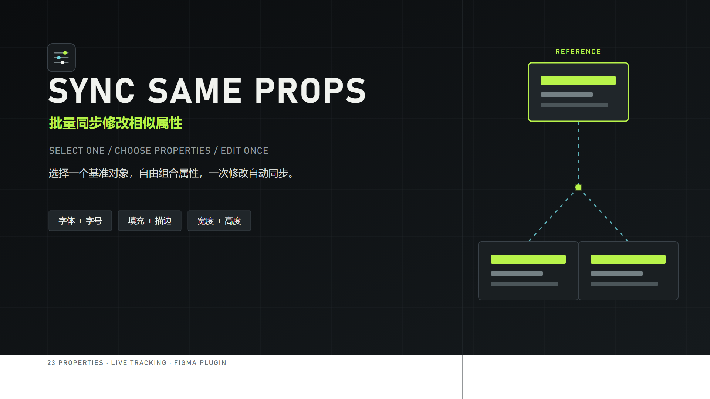

# SyncSameProps - 批量同步修改相似属性



[English](#english) · [中文](#中文)

## 中文

甲方让你统一改颜色、调整文字属性或删除描边时，还在逐个手动修改吗？现在有了更简单的方法。

1. 单选一个基准对象。
2. 任意勾选需要同步的属性，然后开始跟踪。
3. 修改基准对象，所选属性相同的其他对象会自动同步更新。

属性组合同时决定“哪些对象相同”和“具体同步哪些内容”。例如，只勾选“字号”时，所有字号相同的文本都会参与；同时勾选“字体、字号、填充”时，只有三项完全相同的文本参与同步。

### 功能

- 从 23 项属性中自由组合跟踪规则。
- 支持填充、描边、外观、尺寸形态与完整文本属性。
- 内置“文字常用、视觉样式、尺寸形态”快捷组合。
- 实时显示当前匹配对象数量。
- 自动加载文本字体，并通过 Figma Resize API 正确写入宽高。
- 兼容 Figma 属性菜单的悬停预览与回滚，不会丢失正式修改。

### 安装开发版

1. 下载或克隆本仓库。
2. 在 Figma 桌面版中打开 **Plugins → Development → Import plugin from manifest…**。
3. 选择仓库根目录的 `manifest.json`。
4. 运行 **SyncSameProps - 批量同步修改相似属性**。

## English

When a client asks you to change colors, update text properties, or remove borders, are you still making every change manually, one by one? SyncSameProps gives you a faster workflow.

1. Select one reference object.
2. Choose any properties and start tracking.
3. Edit the reference object. Other objects that matched the selected properties automatically update with it.

Your selected properties define both the matching rule and the synchronization scope. Select only **Font size** to update all text with the same size, or combine **Font**, **Font size**, and **Fill** to target only text objects matching all three properties.

### Features

- Build any tracking rule from 23 supported properties.
- Covers fills, strokes, appearance, geometry, and typography.
- Includes quick presets for common text, visual-style, and size workflows.
- Shows the current number of matching objects before you edit.
- Loads fonts safely and writes dimensions through Figma's Resize API.
- Preserves final synchronization after Figma property-menu hover previews roll back.

## Development

No build step or external dependency is required.

```powershell
npm test
npm run check
```

## License

Source available under the [MIT License with Commons Clause and a commercial-output clarification](LICENSE).

- You may use SyncSameProps for paid design work, client projects, and other commercial output.
- You may modify and redistribute it for free while preserving the license notice.
- You may not sell the plugin itself, sell a renamed or modified copy, charge for downloads or access, or offer it as a substantially similar paid service without written permission.

This is a source-available license, not an OSI-approved open-source license. Versions previously obtained under an earlier license retain the rights granted with those versions.
